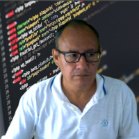

# Fundamentos de Ciência de Dados

## Professores:

Sergio Serra                  | Jorge Zavaleta
------------------------------|--------------------------------|
  | 
[serra@pet-si.ufrrj.br](mailto:serra@pet-si.ufrrj.br) | [zavaleta@pet-si.ufrrj.br](zavaleta@pet-si.ufrrj.br)

## Ementa:
Introdução a reprodutibilidade em pesquisa, proveniência de dados e gestão de grandes volumes de dados científicos. Coleta e preparação de dados. Algoritmos de exploração e análise de dados. Métodos de modelagem fluxo de dados. Elaboração de relatórios de resultados através de documentos com código Python incluindo gráficos e tabelas.

## Módulo 0:

| Temas                        |        Jupyter Notebook     |  PDF          | Atualizado |
|:-----------------------------|:---------------------------:|:-------------:|:----------:|
| Calendário e critérios de aprovação | -                    | ||

## Módulo 1:

| Temas                        |        Jupyter Notebook     |  PDF          | Atualizado |
|:-----------------------------|:---------------------------:|:-------------:|:----------:|
| O que é data science?        | [Introdução a Markdown](FCD_M1_0_Introducao.ipynb) || |
|Data Science, Reprodutibilidade, Replicabilidade em Pesquisa Computacional |  [Reprodutibilidade](FCD_M1_3_Reprodutibilidade.ipynb) |   | |
|Introdução a Proveniência de Dados | [Proveniência](FCD_M1_4_Provenance.ipynb) |  | |
|Gestão de Grandes Volumes de Dados de Pesquisa| Gestão | | x|
|Ambiente de Programação: python 3, jupyter notebook, JupyterLab, Google Colab, DeepNote, pacotes e github | Instalação Anaconda, Jupyter Notebook, Jupyterlab |  | |
|Python I: tipos de dados, sequências e operações, estruturas de controle e repetição | [Tipos de dados](FCD_M1_1_Tipos_de_dados.ipynb). [Estruturas de Controle](FCD_M1_2_Estruturas_de_controle.ipynb) | Exercícios em Jupyter/Colab/Deepnote| |
| Prática dos conteúdos estudados: construindo e operando listas e strings | Exercícios | Jupyter/ Colab/Deepnote| |

## Módulo 2:

| Temas                                 |      Jupyter Notebook               |  PDF         | Atualizado |
|:--------------------------------------|:-----------------------------------:|:------------:|:------------------:|
| Técnicas de coleta e preparação de dados |  [WebScraping](FCD_M2_0_WebScraping.ipynb) |  ||
| Numpy I: array, slicing, fancy index, copy, view e tensores| [Numpy](FCD_M2_1_Numpy.ipynb). [Numpy Avançado](FCD_M2_1_Numpy_avancado.ipynb)    |  | |
| Pandas I: dataframes, series, index, Pandas I/O (csv, json, excel) | [Pandas](FCD_M2_2_Pandas.ipynb)|   | |
| Data cleaning, Exploration | [Data Cleaning](FCD_M2_3_Data_Cleaning.ipynb)|  |   |
| Prática dos conteúdos estudados: Processando e extraindo informações de arquivos csv, json, rdf|x|| |

## Módulo 3:

| Temas                                 |      Teoria                         |  Prática     | Atualizado|
|:--------------------------------------|:-----------------------------------:|:------------:|:---------:|
| Técnicas de análise de dados|  | x| |
| Numpy II e Matplotlib: operações com array, broadcasting, construção de gráficos usuais | |  [Gráficos Estáticos](FCD_M3_1_Graficos_simples.ipynb)||
| Pandas II: estatísticas básicas |  | [Gráficos Avançados](FCD_M3_2_Graficos_avancados.ipynb)| |
| Prática dos conteúdos estudados: manipulando dados de saúde, ambiente, agricultura, cidades inteligentes |  |x| |

## Módulo 4:

|      Temas                            |      Teoria                         |  Prática     | Atualizado |
|:--------------------------------------|:-----------------------------------:|:------------:|:----------:|
| Introdução a técnicas de modelagem de fluxo de dados |  | [Zenodo+Binder](FCD_M1_5_Zenodo_Binder.ipynb)| |
| Algoritmos e técnicas de extração inteligente de conhecimento |  | | |
| Scikitlearn:  introdução a mecanismos de regressão, classificação, clustering e PCA | |  [Machine Learning](FCD_M4_1_Machine_Learning.ipynb)|  |
| Prática dos conteúdos estudados: clusterização e predição | | [Deep Learning](FCD_M4_2_Deep_Learning.ipynb)|   |

## Módulo 5:

| Temas                                 |      Teoria                         |  Prática     | Atualizado |
|:--------------------------------------|:-----------------------------------:|:------------:|:----------:|
| Seminários sobre Ciência de Dados aplicados domínio específicos (e.g. Saúde, Educação, Sustentabilidade, Agricultura, Cidades Inteligentes, covid-19, lógica Fuzzy, entre outros) |  |[Lógica Fuzzy](FCD_2025_2_Fuzzy_Logic.ipynb)|   |
| Apresentação de trabalhos – proposta de artigos|  | ||

## Material Adicional:
1. Re-run, Repeat, Reproduce, Reuse, Replicate: Transforming Code into Scientific Contributions Fabien C. Y. Benureau and Nicolas P. Rougier. 
2. Provenance and the Different Flavors of Computational Reproducibility J. Freire and F. Chirigati In IEEE Data Engineering Bulletin, 41(1), pp. 15-26, 201. 
3. Web Semãntica: Uma introdução. 

## FORMA DE AVALIAÇÃO

Critérios de aprovação são os do PPGI/UFRJ. A avaliação consiste em participação em sala de aula (P); exercícios e/ou protótipos desenvolvidos (E); apresentações/ /escritas de artigos (A).

## BIBLIOGRAFIA
**Básica**
1. National Academies of Sciences, Engineering, andMedicine. Reproducibility and Replicability in Science. Washington, DC: The National Academies Press, 1st Edition, 2019.
2. Victoria Stodden, Friedrich Leisch, Roger D. Peng, Implementing Reproducible Research, CRC Press, 1st Edition, 2014.
3. Kleppmann, M., Designing Data-Intensive Applications: The Big Ideas Behind Reliable, Scalable, and Maintainable Systems, O’Reilly, 2017.
4. Taylor, E. Deelman, D.B. Gannon, M. Shields (Eds.), Workflows for e-Science: Scientific Workflows for Grids, Springer, 2006.
5. Wes McKinny, Python for Data Analysis: Data Wrangling with Pandas, NumPy, and IPython, 2nd edition O'Reilly Media, 2017
6. Mark Lutz, Learning Python, 5th Edition, O'Reilly Media, 2013
7. Jonh Hearty, Advanced Machine Learning with Python. Packt Publishing, 2016.
8. Andreas C. Mueller and Sarah Guido, Machine Learning with Python. O'Reilly Media, 2016.
9. John D. Kelleher, Brian Mac Namee, and Aoife DArcy. Fundamentals of machine learning for predictive data analytics: algorithms, worked examples, and case studies. MIT, 2015.
10. Fernando Amaral, Introdução à Ciência de dados: Mineração de dados e Big Data. Alta Books, 2016. ISBN:978-85-7608-934-6
10. Artigos Selecionados

**Complementar**

11. Christopher Gandrud, Reproducible Research with R and R Studio (Chapman & Hall/CRC The R Series) 1st Edition
12. Garret Christense, Jeremy Freese, Edward Miguel, Transparent and Reproducible Social Science Research, University of Californy Press, 1st edition, 2019
13. Justin Kitzes (Editor), Daniel Turek (Editor), Fatma Deniz (Editor), The Practice of Reproducible Research Case Studies and Lessons from the Data-Intensive Sciences, University of Californy Press, 1st edition, 2017
14. Aurélien Géron, Hands-On Machine Learning with Scikit-Learn and TensorFlow: Concepts, Tools, and Techniques to Build Intelligent Systems. O'Reilly Media, 2017.
15. Aurélio Géron, Hands-On Machine Learning with Scikit-Learn, Keras, and TensorFlow. Concepts, Tools, and Techniques to Build Intelligent Systems. O'Reilly Media, 2019.
16. Manohar Swamynathan, Mastering Machine Learning with Python in Six Steps. Apress, 2017.
17. Michel Bowles, Machine Learning in Python®: Essential Techniques for Predictive Analysis. John Wiley & Sons, Inc. 2015.

## RECURSOS EDUCACIONAIS ADICIONAIS

1. The Open Science Training - Handbook https://book.fosteropenscience.eu/en/01Introduction/
2. Recursos indicados em sala de aula

## Trabalhos da disciplina
### 2020.3/2021.1
1. **Os impactos das fake-news na população mundial**. Autores: Monica Novellino, Sírius Da silva, Vinicius Da Silva,2020. 
2. **O uso das Redes Sociais Digitais e as Eleções para o Cargo de Prefeito do Rio de Janeiro**. Autores: Ana Paula Vasconcelos, Jivago Medeiros, Rafael Escalfoni, Silas Filho, Sírius Da Silva,2020. 

### 2022.2
1. **Scientific Recommender**. Aurores: Ingrid Pacheco, Eduardo Prata e Renan Parreira. 2022. 
2. **drecvm**. Autores: Valquire, Saulo Almeida, Gilberto Gil, 2022. 
3. **Estudo sobre a Participação das Mulheres nos Cursos de Graduação na Área STEM**. Autores: Alexandre N. Louzada, Lenise M. V. Rodrigues, Lucas Lopes Felipe e Luciane C. J. de Deus. 
4. **Queimadas no Pantanal: Uma análise exploratória da última década**. Autores: Charles Pimentel e Isaac D'Césares. 2022. 
5. **MonkeyPox Feelings**. Autores: Eliel Roger, Fillipe Dornelas. 2022. 
6. **Estudo de caso utilizando dados do INMET no ano de 2019 - ISNA**. Autores: Anderson Neto, Alex Santos, Douglas Castro. 2022. 

### 2024.2
1. Análise Comparativa de Dados de Segurança Pública no Brasil: Uma Abordagem Estatística e Visual. Autor: Emerson Duarte, 2024. 
2. Decifrando Dados linguísticos: Análise comparativa dos lematizadores para língua portugues. Autor: Mariana Gonçalves da Costa, 2024. 
3. Educação básica e deficiências visual e auditiva no Brasil no ensino à distância: Dados e perspectivas a partir dos Microdados do INEP (2021-2023), 2024. Autor: Andreza Santos. 
4. Sistema Computacional para Apoio no Controle de Dopagem. Autor: Guy Junior, 2024. 
5. Avaliação e Proveniência de dados públicos da ANP. Autor: Ubirajara S. Santos, 2024. 
6. xx Autor: Fuschilo, 2024. 
7. Análise de Dados Climáticos e Históricos da Produção de Algodão no Brasil. Autor: Raphael Mauricio Sanches de Jesus, 2024. 

### 2025.2
1. Analise dos aspectos de Títulos e conteúdos que influenciam a atratividade de Vídeos educacionais de matemática no Youtube no contexto Brasileiro. Autor: Tiago César Cunha da Costa, 2025. 
2. Construção de dataset dos fatores da produção da leite entre as regiões do Brasil. Autor: Max Felipe S. S. Cravo, 2025. .pdf)
3. Izabelle Rizzo, NOT FOUND!!
4. André Ferreira Zeferino. NOT FOUND!!
5. NOT FOUND!!
6. NOT FOUND!!

---
### Cite as
---
>Sergio Serra, & Jorge Zavaleta. (2020, February 21). zavaleta/Fundamentos_DS: Repository of Data science Fundamentals (Version fds). Zenodo. http://doi.org/10.5281/zenodo.4553793

---
**Fundamentos para Ciência de Dados &copy; copyright, Sergio Serra e Jorge Zavaleta, 2021, 2022, 2024**
